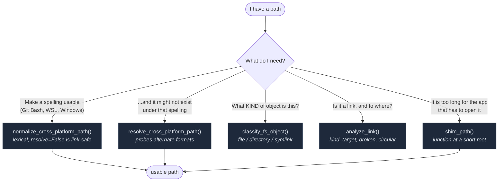

# dazzle-filekit

**Cross-platform file operations with path handling, verification, and metadata preservation.**

```{admonition} Documents v0.4.3
:class: note
Last reviewed 2026-07-31. Anything released since is in the
[changelog](https://github.com/DazzleLib/dazzle-filekit/blob/main/CHANGELOG.md).
```

Python's standard library handles the common cases well. `dazzle-filekit`
exists for the ones where it quietly does the wrong thing on Windows: a
junction that every stdlib check reports as an ordinary directory, a path over
260 characters that a reader refuses to open, a copy that loses its ACLs and
creation time, a UNC path that works from one spelling and not another.

```console
pip install dazzle-filekit
```

---

## Where this sits

filekit is **L1** in the
[DazzleLib stack](https://github.com/DazzleLib/.github/blob/main/docs/STACK-MAP.md):
it owns *what you do to a file* — "do ONE thing to ONE filesystem object,
correctly, on every OS." Path **identity** belongs one layer down, link
*serialization* one layer up, and orchestration above that. Knowing which layer
answers your question saves reaching for the wrong tool.

```mermaid
flowchart TB
    PRESERVE["<b>L3</b> preservelib<br/><i>manifests · conflict policy · rollback</i>"]
    LINKLIB["<b>L2</b> dazzle-linklib<br/><i>links as portable data</i>"]
    FILEKIT["<b>L1 · dazzle-filekit</b><br/><i>copy · verify · metadata<br/>links · long paths</i>"]
    UNC["<b>L0</b> unctools<br/><i>UNC ↔ drive identity</i>"]
    LIB["<b>B</b> dazzle-lib<br/><i>Protocols · payload types</i>"]

    PRESERVE --> FILEKIT
    LINKLIB --> FILEKIT
    FILEKIT --> LIB
    FILEKIT -. "declared, imported lazily" .-> UNC
    UNC --> LIB

    classDef here fill:#2563eb,stroke:#1e40af,color:#fff
    class FILEKIT here
```



Solid = eager runtime dependency. Dashed = declared but not in the import
graph, following the convention of the
[canonical dependency chain](https://github.com/DazzleLib/.github/blob/main/docs/STACK-MAP.md#dependency-chain-mermaid),
which this is a filekit-centred subset of. `dazzletreelib` (traversal) sits
orthogonal to the layers and is not shown.

```{admonition} "Hard dependency" and "no runtime import" are both true
:class: note

`pyproject.toml` declares `unctools>=0.2.2`, so `pip install dazzle-filekit`
always brings it — that is the sense in which it is a **hard dependency** as of
0.3.0. But filekit never imports it at module load: the imports live inside
functions, and `_fallback.py` (the one module importing it at top level) is
itself imported lazily. `import dazzle_filekit` succeeds with unctools blocked
entirely.

Both claims describe the same design from different angles — always installed,
never eagerly loaded — which is why the stack map draws this edge dashed while
filekit's own docs call it hard. See
[unctools integration](unctools-integration.md) for the resolver edge that uses
it.
```

---

## Start here

::::{grid} 1 1 2 2
:gutter: 3

:::{grid-item-card} 📖 API Reference
:link: api-reference
:link-type: doc

Every public symbol, grouped by subsystem. Start here if you know roughly what
you want and need the signature.
:::

:::{grid-item-card} 🔒 API Stability
:link: api-stability
:link-type: doc

Which symbols are locked, and which external tools depend on each. Read before
changing anything.
:::

:::{grid-item-card} 🖥️ Platform Support
:link: platform-support
:link-type: doc

What works where, the path-conversion table, and per-platform test counts
measured from CI.
:::

:::{grid-item-card} 🔗 UNCtools Integration
:link: unctools-integration
:link-type: doc

The resolver edge, UNC ↔ drive conversion, and what actually counts as a UNC
path (it is broader than you think).
:::

::::

---

## Which path function do I want?

Four functions look interchangeable and are not. This is the question to ask
first:



```{admonition} The one that surprises people
:class: warning

`classify_fs_object` returns `'directory'` for a junction — correctly, since a
junction *is* a directory. It answers "what kind of object", not "is this a
link". For link-ness use `analyze_link` or `is_junction`; `os.path.islink()`
returns **False** for a junction and will mislead you.
```

---

## Two Windows problems worth knowing about

:::::{grid} 1 1 2 2
:gutter: 3

::::{grid-item-card} Paths over `MAX_PATH`

A 260-character limit that `\\?\` only *partly* lifts: it works at the API
layer, but not for an application that copies the path into a fixed buffer —
measured in two independent PDF readers.

`shim_path()` sites a junction at a short root and hands back a shorter name
for the same bytes, so **any** application can open the file.

+++
[Long-Path Shims →](api-reference.md#long-path-shims-v040-dazzle_filekitlongpath)
::::

::::{grid-item-card} Junctions lie to every naive check

For a junction, `os.path.islink()` is `False`, `os.path.isdir()` is `True`,
and `DirEntry.is_symlink()` is `False`. It presents as an ordinary directory,
so a recursive delete can walk through one into live data.

Use `is_junction()` (reparse-tag based) and `remove_link()` / `remove_shim()`.

+++
[Link Primitives →](api-reference.md#link-primitives-v030-dazzle_filekitlinks)
::::

:::::

---

```{toctree}
:maxdepth: 2
:caption: Reference

api-reference
recipes
autoapi
api-stability
platform-support
```

```{toctree}
:maxdepth: 2
:caption: Integration

unctools-integration
preservelib-integration
```

```{toctree}
:maxdepth: 1
:caption: Project

changelog
breaking-changes
contributing
```
