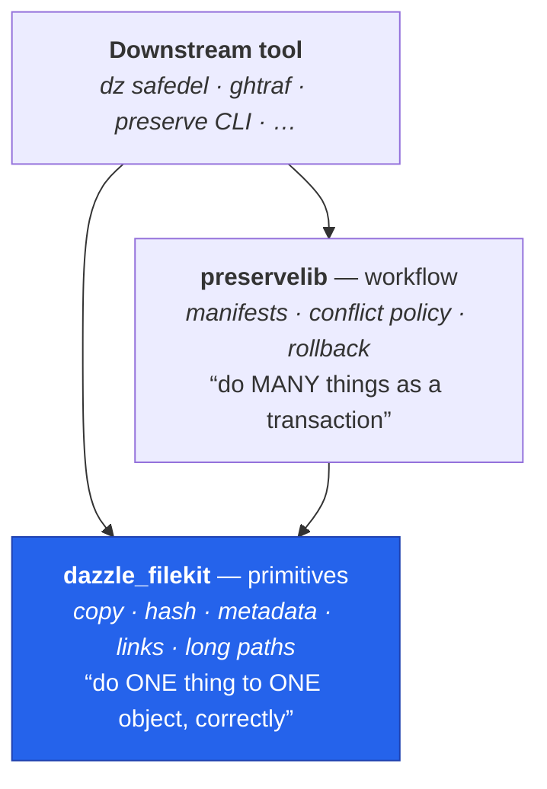

# preservelib Integration Guide

This doc describes how `preservelib` and `dazzle_filekit` relate, and the
recommended pattern for preservelib (or any similar workflow library) to
depend on filekit.

**Scope**: This is a guide for the preservelib maintainers. It does not
mandate changes to preservelib -- it documents the integration contract
from filekit's side so the two can evolve together.

**preservelib locations** (three known copies as of 2026-04-10):

- `C:\code\preserve\preservelib\` (upstream canonical)
- `C:\code\dazzlecmd\github\projects\core\safedel\_lib\preservelib\`
  (junction into the safedel bundle, same code as upstream)
- `C:\code\github-traffic-tracker\local\src\ghtraf\lib\preserve_lib\`
  (vendored copy, `preserve_lib` with underscore)

---

## The layering contract



The dependency runs **one way only**: preservelib imports filekit, never the
reverse. A tool may reach past preservelib straight to filekit when it only
needs a primitive — that is the second arrow, and it is deliberate, not a
layering violation.

- **`dazzle_filekit`** is the *primitives* layer. Its functions operate on
  individual files/paths and return data. They never drive a workflow.
  Examples: `copy_file`, `collect_file_metadata`, `calculate_file_hash`,
  `atomic_write_json`, `normalize_cross_platform_path`, `analyze_link`.

- **`preservelib`** is the *workflow* layer. Its functions orchestrate
  the "save manifest + copy tree + verify hash + restore metadata"
  lifecycle that tools like safedel and ghtraf need. It calls into
  filekit for every leaf operation.

- **Dependency direction**: `preservelib → dazzle_filekit`, one-way.
  filekit never imports preservelib. If preservelib needs something
  filekit doesn't yet provide, the rule is: add it to filekit as a
  primitive, then call it from preservelib.

---

## Recommended import pattern (for preservelib)

preservelib currently uses this pattern in `operations.py` and
`restore.py`:

```python
try:
    from dazzle_filekit import paths, operations, verification
    HAVE_FILEKIT = True
except ImportError:
    HAVE_FILEKIT = False
    # local fallback implementations
```

This is fine as a transitional shim but should be replaced. Once
`dazzle-filekit >= 0.2.4` is a hard dependency in preservelib's
`pyproject.toml`, the fallback branch can be deleted.

Preferred forward pattern:

```python
from dazzle_filekit import (
    copy_file,
    calculate_file_hash,
    collect_file_metadata,
    apply_file_metadata,
    atomic_write_json,
    copy_tree_preserving_links,
)
from dazzle_filekit.metadata import (
    is_win32_available,
    restore_windows_creation_time,
)
from dazzle_filekit.paths import (
    normalize_cross_platform_path,  # resolve=True (link-following) / default (link-safe)
    classify_fs_object,
)
from dazzle_filekit.utils.compat import is_windows, is_wsl
```

Rationale: top-level names for the "common" stuff, submodule imports
for the "specific" stuff. Matches the convention in
`docs/api-stability.md`.

---

## What moves from preservelib to filekit in v0.2.4

The following functions have been ported *from* preservelib *into*
`dazzle_filekit.metadata`. The originals in preservelib can be deleted
(or reduced to thin re-exports) once preservelib pins
`dazzle-filekit >= 0.2.4`:

| preservelib symbol | filekit replacement |
|--------------------|---------------------|
| `preservelib.metadata.collect_file_metadata` | `dazzle_filekit.metadata.collect_file_metadata` (same signature, returns same dict shape) |
| `preservelib.metadata.apply_file_metadata` | `dazzle_filekit.metadata.apply_file_metadata` |
| `preservelib.metadata.restore_windows_creation_time` | `dazzle_filekit.metadata.restore_windows_creation_time` |
| `preservelib.metadata._collect_unix_xattrs` | `dazzle_filekit.metadata._collect_unix_xattrs` (same private-ish name) |
| `preservelib.metadata._apply_unix_xattrs` | `dazzle_filekit.metadata._apply_unix_xattrs` |
| `preservelib.metadata.is_win32_available` | `dazzle_filekit.metadata.is_win32_available` |
| `preservelib.metadata.metadata_to_json` | `dazzle_filekit.metadata.metadata_to_json` |
| `preservelib.metadata.compare_metadata` | `dazzle_filekit.metadata.compare_metadata` |

**These ports are byte-identical** -- filekit's version is the same code
as preservelib's, just moved. No behavior change.

The ports preserve preservelib's rich feature set:

- Windows: SDDL ACL round-trip via `win32security.GetFileSecurity` +
  `ConvertStringSecurityDescriptorToSecurityDescriptorW`; creation-time
  restoration via `SetFileTime` with `FILE_WRITE_ATTRIBUTES=0x100` and
  `FILE_FLAG_BACKUP_SEMANTICS` for directories; base64 encoding for
  binary ACL blobs.
- Linux/macOS: extended attributes via `os.listxattr` / `getxattr` /
  `setxattr` (stdlib Python >= 3.3); skip `com.apple.quarantine` on
  restore to avoid surfacing "downloaded from the internet" warnings
  on recovered files.

---

## What stays in preservelib

The workflow-level functions stay in preservelib -- they are not
primitives, they are orchestration:

- `preservelib.operations.copy_file_with_metadata` (the full
  copy-then-verify-then-restore-metadata sequence)
- `preservelib.operations.preserve_file` (top-level entry for saving
  a file to a manifest)
- `preservelib.restore.restore_file` (top-level entry for restoring
  from a manifest)
- Manifest format handling (JSON schema, versioning, path rewriting)

If preservelib ever wants to be folded *into* filekit, these would
land in a new `dazzle_filekit.workflow` submodule -- but that is out
of scope for v0.2.4.

---

## Version pinning guidance

In your downstream tool's `pyproject.toml` or `requirements.txt`:

```toml
dependencies = [
    "dazzle-filekit>=0.4.0,<0.5",  # metadata, link primitives, long-path shims
    "preservelib>=0.X.Y",            # for workflow orchestration
]
```

**Updated for 0.4.x.** This section previously advised `>=0.3.0,<0.4` on the
reasoning that "a future 0.4.0 may break again". That prediction did not hold:
**0.4.0 was additive-only** — no symbol removed, renamed, or behaviour-changed.
It went to a minor rather than a patch for *risk class*, not compatibility,
because it introduced the first module that creates and deletes filesystem
objects (`longpath`), and a consumer taking a patch bump should not discover it
can mint reparse points on their system drive.

So a `<0.4` cap now excludes every current release for no compatibility reason.
Anything written against 0.3.x still works on 0.4.x unchanged.

The remaining `<0.5` cap is ordinary caution rather than a known hazard: 0.3.0
*was* a clean break (removing `normalize_path` / `normalize_path_no_resolve` /
`get_path_type` and folding `get_drive_mappings` into unctools), so capping at
the next minor is a reasonable default until a release proves otherwise.
Consult [api-stability.md](api-stability.md) — every locked symbol lists the
external callers depending on it, and breaking one requires a migration commit
in each.

---

## Questions / open items

- **Should preservelib become a submodule of filekit?** Not yet. Keep
  the two packages separate until preservelib's manifest format
  stabilizes and is released to PyPI at least once.
- **Should the three preservelib copies be unified into one?** Yes,
  eventually. The current state (upstream in `C:\code\preserve\`,
  junction in safedel, vendored in ghtraf) is tech debt. Unifying is
  a separate track from this filekit consolidation.
- **What about the `_lib/preservelib/` junction inside safedel?**
  Leave it alone for v0.2.4. Safedel uses the junction so it can bundle
  preservelib without a PyPI release. When preservelib ships to PyPI,
  the junction can be removed and replaced with a normal dependency.
